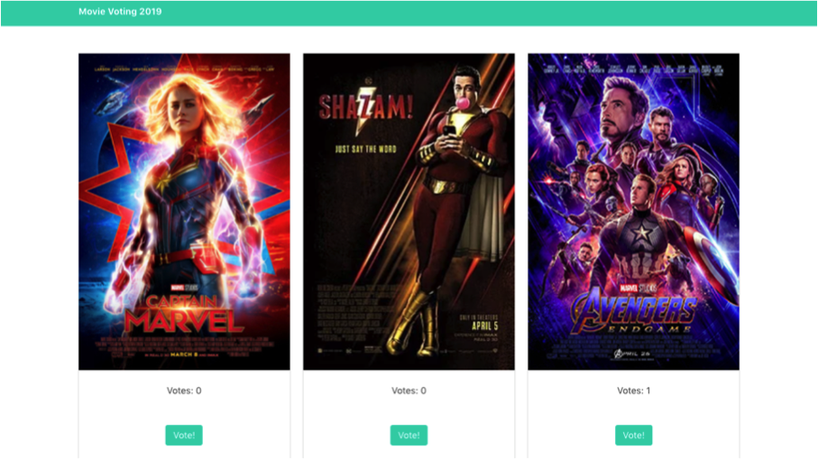
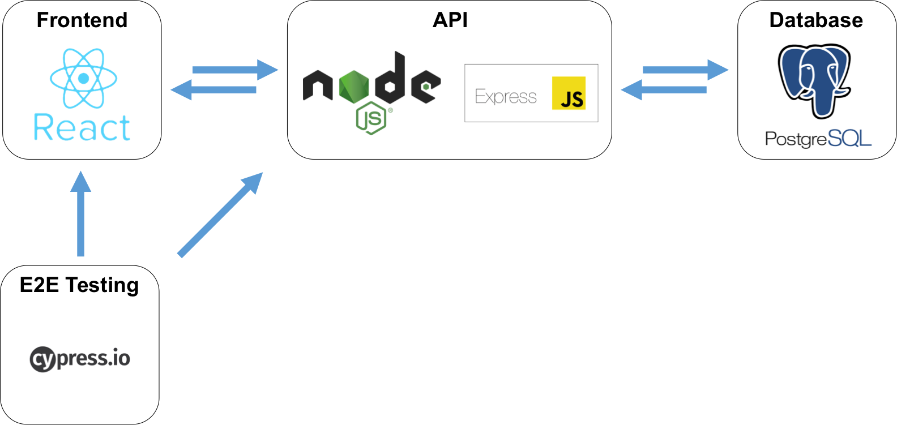
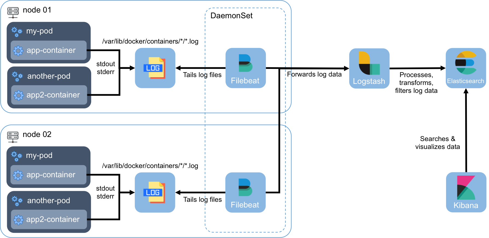
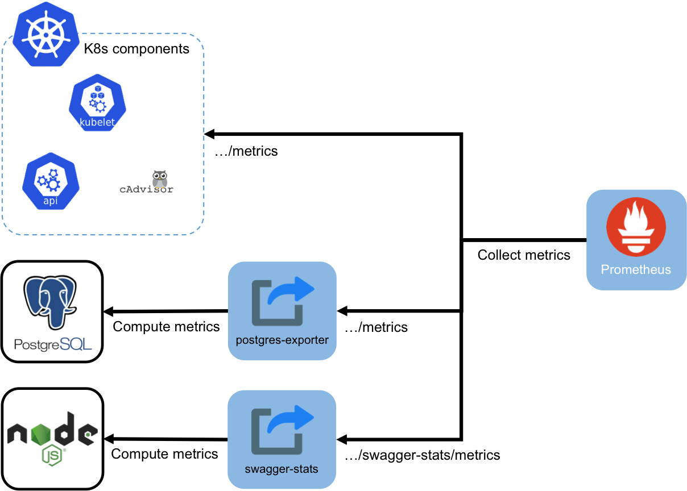

# Movie Voting App (Javascript)

## Application Introduction


<p style="text-align: center;">&#8673 Application's screenshot</p>

The movie voting app collects votes from users on the favourite movies. The app is built with **React.js** (frontend), **Node.js** and **Express** (backend), and **PostgreSQL** database. It also includes End-to-end testing written with **Cypress**.

A simple illustration of the application architecture:



## Docker deployment

The application’s [docker-compose.yml](/docker-compose.yml) file is included in the project, use the **_docker-compose up_** command on the **project's root folder** to deploy the application on Docker.
```
$ docker-compose up --build –d
```

## Kubernetes Deployment

Also included in the project are the application’s yaml files for Kubernetes deployment, accessible in the **“k8s”** folder. While the **“logging”** and **“monitoring”** folders inside the **“k8s”** folder contains yaml files for **ELK stack** logging and **Prometheus** monitoring deployment on Kubernetes. The deployment architecture of the application on Kubernetes is illustrated below. 

<div style="display: block; text-align: center;">
  
</div>
<p style="text-align: center;">&#8673 Application deployment architecture on Kubernetes</p>

<div style="display: block; text-align: center;">
  
</div>
<p style="text-align: center;">&#8673 Basic ELK stack architecture on Kubernetes</p>

<div style="display: block; text-align: center;">
  
</div>
<p style="text-align: center;">&#8673 Basic Prometheus architecture on Kubernetes</p>
